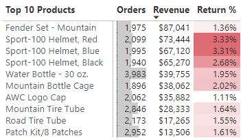
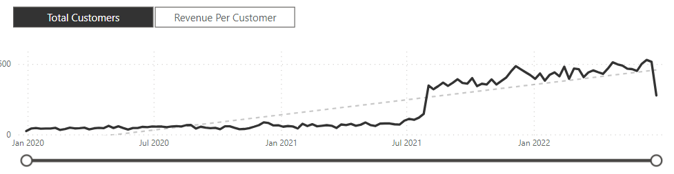
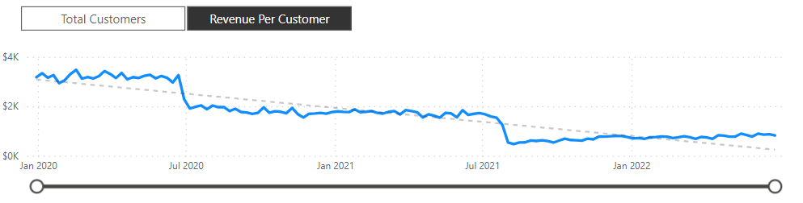

# AdventureWorks Power BI Dashboard

An interactive Power BI dashboard built using the AdventureWorks dataset to analyse sales, revenue, profit, orders, returns, customer behaviour, product performance and regional trends.

This project was completed as part of my Power BI learning journey using the Maven Analytics / Udemy Power BI Desktop course materials. The report was built in Power BI Desktop using raw CSV files and follows the full business intelligence workflow: data preparation, data modelling, DAX measure creation and interactive dashboard design.
<br><br>


---

## Table of Contents

- [Introduction](#introduction)
- [Project Objective](#project-objective)
- [Tools Used](#tools-used)
- [Dataset](#dataset)
- [Design Process](#design-process)
- [Dashboard Pages](#dashboard-pages)
- [Key Features](#key-features)
- [Insights](#insights)
- [Repository Structure](#repository-structure)
- [How to View](#how-to-view)
- [Credits](#credits)

---

## Introduction

AdventureWorks is a fictional global company that manufactures and sells cycling equipment and accessories. The management team needs a clear way to monitor business performance, compare regional sales, analyse product-level trends and identify high-value customers.

The dashboard provides an interactive view of the company’s performance across sales, products, customers, returns and territories.

---

## Project Objective

The objective of this project was to build a Power BI report that helps users answer key business questions such as:

- How are revenue, profit, orders and returns performing?
- Which product categories and products are driving sales?
- Which products have higher return risk?
- Which customers generate the most revenue?
- How does performance vary across countries and territories?
- How are key metrics trending over time?

---

## Tools Used

- Microsoft Power BI Desktop
- Power Query
- DAX
- Data modelling
- CSV files
- GitHub

---

## Dataset

The dataset contains raw CSV files for:

- Calendar dates
- Customers
- Products
- Product categories
- Product subcategories
- Sales transactions
- Returns
- Sales territories

The dataset and scenario are based on the Maven Analytics / Udemy Power BI Desktop course materials and Microsoft’s AdventureWorks sample data.

---

## Design Process

The project followed a complete Power BI workflow:

1. Connected to raw CSV files.
2. Cleaned and transformed data using Power Query.
3. Created a relational data model using fact and lookup tables.
4. Built relationships between sales, returns, products, customers, calendar and territory tables.
5. Created DAX measures for revenue, cost, profit, orders, returns, return rate and targets.
6. Designed interactive report pages for executive, product, customer and geographic analysis.
7. Added slicers, bookmarks, drillthrough, field parameters and custom tooltips to improve interactivity.

---

## Dashboard Pages

### Executive Dashboard

- High-level KPI tracking for revenue, profit, orders, and return rates
- Target KPIs for month-to-month performance vs expectations
- Top products performance with regard to category
- Page level filtering for detailed analysis
- Drill-through feature to populate product detail view
---

### Map

- Scaled map view of total orders by location
- Slicer for quick filters by region

---

### Product Details

- Detailed, per-product performance created by drill-through
- Price adjustment metric for performing "what-if" analysis
- Product metric for trending specific product data such as orders, revenue, profit, returns, and return %

---

### Customer Details

- It shows total customers, revenue per customer, customer trends, demographic segments and top customers by revenue.

---
### Custom Additions
- Custom tooltip UI for on-demand metrics
- Popup filter pane for year and geography
- Sidebar navigation for improved user-experience

---

### Category Tooltip

The Category Tooltip is a custom report page tooltip used to show extra category-level information when hovering over selected visuals. This keeps the main report pages clean while still giving users access to supporting detail.


---

## Key Features

- Power Query data cleaning and transformation
- Appending sales files from multiple years
- Relational data model with fact and dimension tables
- Star and snowflake schema structure
- Explicit DAX measures
- Time intelligence calculations
- KPI cards
- Map visual
- Product drillthrough
- Customer analysis
- Field parameters
- Bookmarks and reset buttons
- Custom report page tooltip
- Conditional formatting
- Interactive slicers

---

## Insights

- Approximately $24.9 million in revenue and $10.5 million in profit was generated between 01/01/2020 and 30/06/2022. There is an appreciable dip in revenue between 01/06/2020 and 01/11/2020 (possibly due to the simulated impact of the COVID-19 pandemic), after which revenue appears to grow linearly. December 2021 was an exceptional year in terms of revenue at $1.64 million, and it would be worth investigated the cause of this. Was this due to a highly successful seasonal campaign, e.g. a Black Friday promotion?
- Understandably, tires and tubes are the most ordered product type, while cycling shorts are the most returned product type. After mountain bike fenders, sports helmets top the list of revenue-generating products, despite having relatively high return rates:
<br><br>
       
<br><br>
- The most profitable product categories are clothing and accessories.
- There is a step change (on the order of 200 customers per week) in total weekly customers beginning 02/08/2021.
<br><br>

<br><br>
- However, revenue per customer has been declining year-on-year:
<br><br>

<br><br>
---

## Repository Structure

```text
adventureworks-powerbi-dashboard/
│
├── AdventureWorksReport.pbix
│
├── data/
│   ├── AdventureWorks Calendar Lookup.csv
│   ├── AdventureWorks Customer Lookup.csv
│   ├── AdventureWorks Product Categories Lookup.csv
│   ├── AdventureWorks Product Lookup.csv
│   ├── AdventureWorks Product Subcategories Lookup.csv
│   ├── AdventureWorks Returns Data.csv
│   ├── AdventureWorks Sales Data 2020.csv
│   ├── AdventureWorks Sales Data 2021.csv
│   ├── AdventureWorks Sales Data 2022.csv
│   └── AdventureWorks Territory Lookup.csv
│
├── images/
│   ├── AdventureWorksDemo.gif
│   ├── revenue_per_customer.png
│   ├── total_weekly_customers.png
│   ├── top_revenue_products.png
│   └── More---
│
└── README.md
```
## How to View

1. Download the [AdventureWorksReport.pbix](AdventureWorksReport.pbix) file from this repository.
2. Open the file in Microsoft Power BI Desktop.
3. Use the report navigation buttons to move between the Executive Dashboard, Map, Product Details and Customer Details pages.
4. Interact with slicers, drillthrough actions, bookmarks and tooltips to explore the dashboard.

Power BI Desktop is required to open and interact with the `.pbix` file.

## Credits

This project was completed as part of my Power BI learning using the Maven Analytics / Udemy course **Microsoft Power BI Desktop for Business Intelligence**.

The dataset and project scenario are based on the AdventureWorks sample data and are used here for learning and portfolio demonstration.
